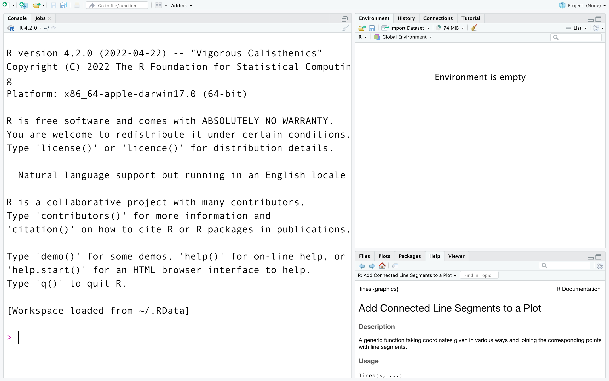
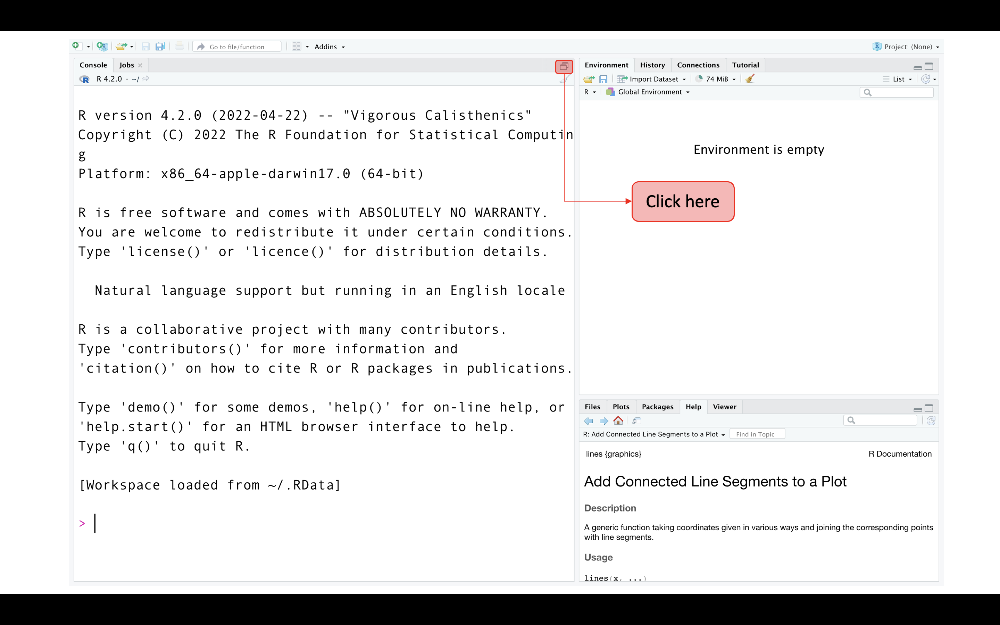
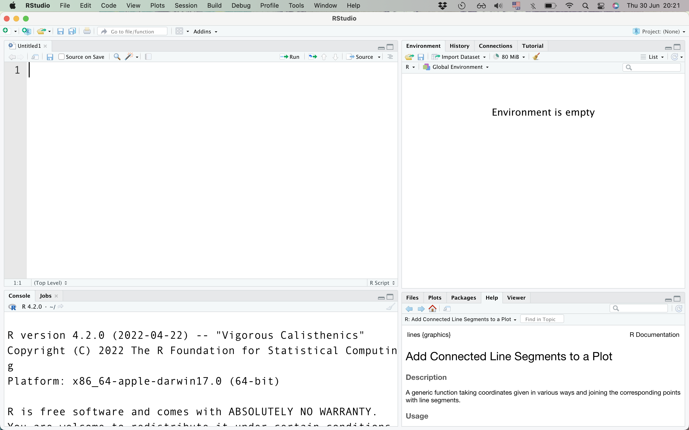
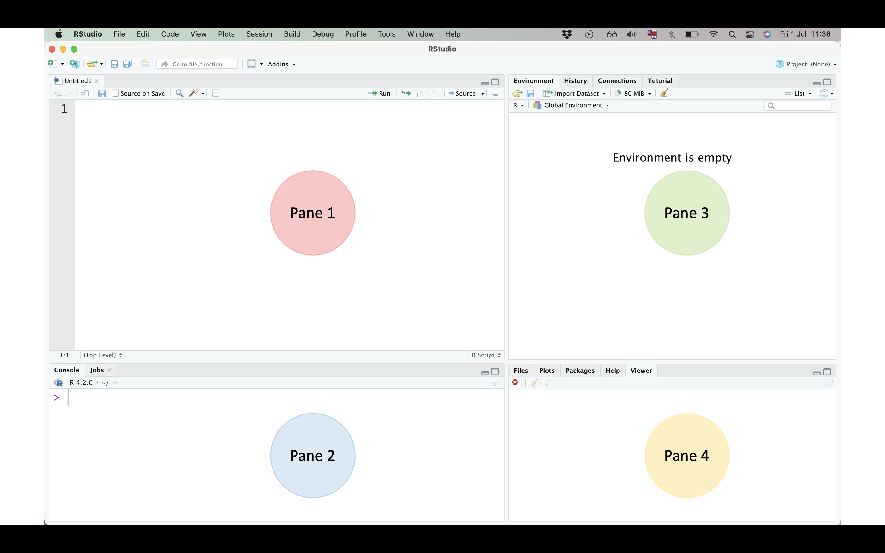
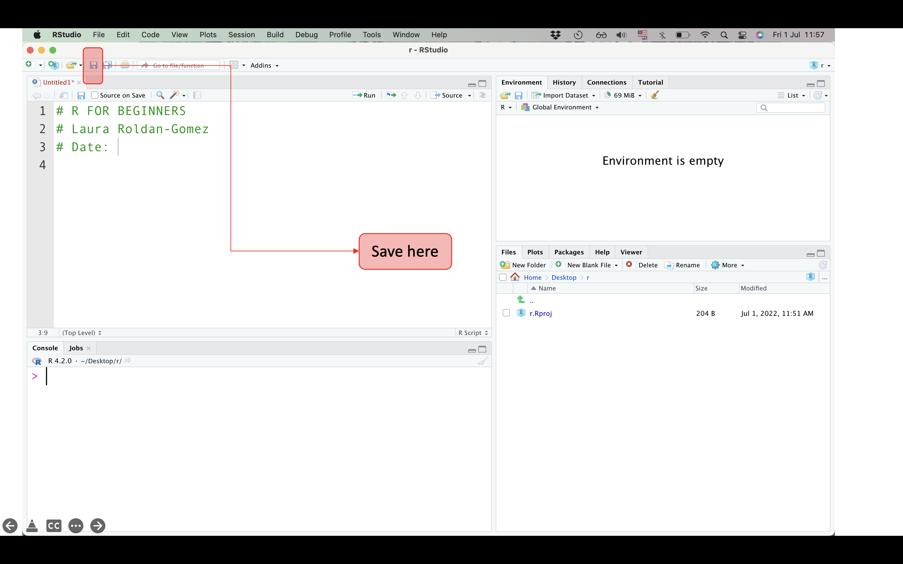
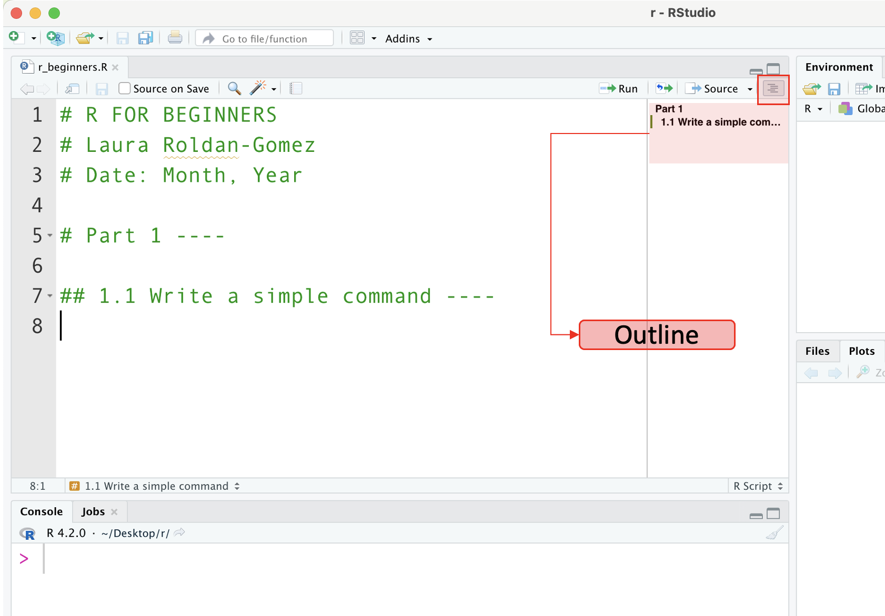

# What does R look like?

Now, let's open RStudio and see what it looks like. 

When you open RStudio, you will see a screen like this one:

 

Click on the icon to get the screen with four sections and I'll run you through all of them.

 

Now, you should see something like this:

 

You can change the settings in your computer to reorder the different sections, or to change the appearance of your screen.

 

# Let's get you acquainted
You should see 4 panes on your screen. We'll talk about each one.

 

**Pane 1:** This pane holds your script, set of commands, or code. The script is your working document.

- Add a title, your name, and a date. Use the hash tag (#) symbol to tell R that this is a reading text and not a command.
- Save it to your computer as you would do with a word or excel file.

 

Let's play with the basic features of RStudio and populate our first script.

 

**Creating an outline**
1. Create a title that reads "Part 1". Use one hash tag symbol at the beginning and end with 4 dashes (- - - -).

2. Create a subtitle that reads "1.1 Writing a simple command" Now, use two hash tags at the beginning and, as before, end with 4 dashes (- - - -).

3. Look at the outline. This feature is very useful to navigate your script when it starts growing.

 

Let's move on.

 

