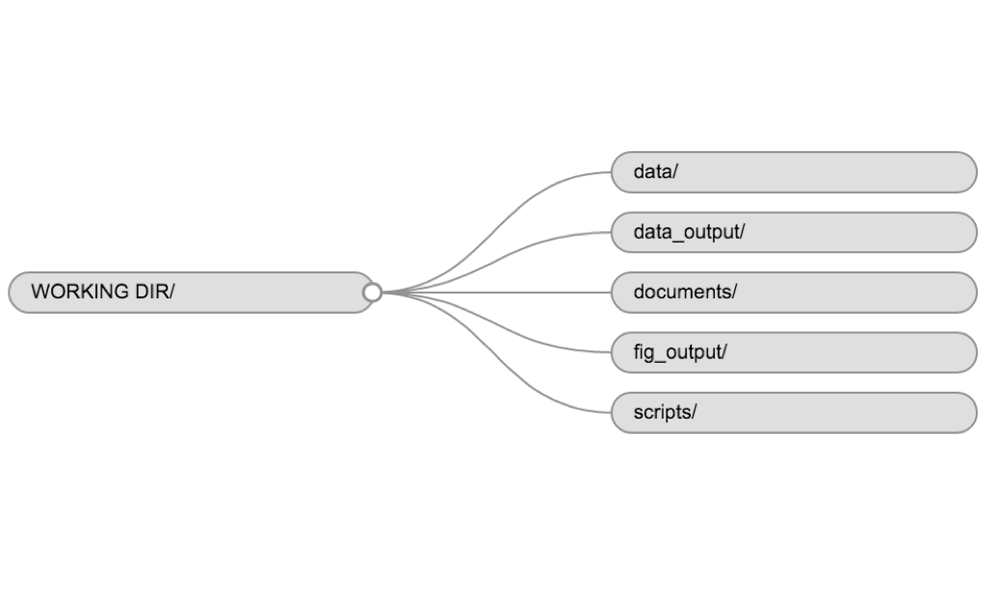

# Good Practices

Always keep in mind these *Good Practices*.

- *Commenting (#).* A script is a conversation with your future self.

- *Outline.* Use the ouline feature to create documents with a structure.

- *Set up a working directory.* Use a command so that when you reopen your script, you know where everything is.

- *The devil is in the details* The most likely explanation for an error message is that you missed something small like a comma. Check for these missing details before stressing out.

- *Google it out* If you want to do something complicated chances are somebody else has tried before. Google for solutions to your problems. If there is no solution, use Stackoverflow.

- *Save your workspace*... it will be handy later.

- *One script per job.* When you become more proficient, you scripts will grow considerably. Try to create separate scripts, especially for data cleaning process.

- *Create a pseudocode.* Start your script by setting up the titles of your sections. Then progresively, populate the sections with subtitles and lastly, fill out your code with commands. Normally, I would add the sections: Set up, Data, Data Cleaning, Data analysis, Data plotting, and Wrap up. 

It is good practice to keep a set of related data, analyses, and text
self-contained in a single folder, called the **working directory**. All of the
scripts within this folder can then use *relative paths* to files that indicate
where inside the project a file is located (as opposed to absolute paths, which
point to where a file is on a specific computer). Working this way makes it
a lot easier to move your project around on your computer and share it with
others without worrying about whether or not the underlying scripts will still
work.

RStudio provides a helpful set of tools to do this through its "Projects"
interface, which not only creates a working directory for you but also
remembers its location (allowing you to quickly navigate to it) and optonally
preserves custom settings and open files to make it easier to resume work after
a break. Below, we will go through the steps for creating an RProject for this
tutorial.

* Start RStudio (presentation of RStudio -below- should happen here)
* Under the `File` menu, click on `New project`, choose `New directory`, then
  `Empty project`
* Enter a name for this new folder (or "directory", in computer science), and
  choose a convenient location for it. This will be your **working directory**
  for the rest of the day (e.g., `~/data-carpentry`)
* Click on "Create project"
* Under the `Files` tab on the right of the screen, click on `New Folder` and
  create a folder named `data` within your newly created working directory. (e.g., `~/data-carpentry/data`)
* Create a new R script (File > New File > R script) and save it in your working
  directory (e.g. `data-carpentry-script.R`)

Your working directory should now look like this:

## Organizing your working directory

Using a consistent folder structure across your projects will
help keep things organized, and will also make it easy find/file things in the
future. This can be especially helpful when you have multiple projects. In
general, you may create directories (folders) for **scripts**, **data**, and
**documents**.

 - **`data/`** Use this folder to store your raw data and intermediate
   datasets you may create for the need of a particular analysis. For the sake
   of transparency and [provenance](https://en.wikipedia.org/wiki/Provenance),
   you should *always* keep a copy of your raw data accessible and do as much
   of your data cleanup and preprocessing programmatically (i.e. with scripts,
   rather than manually) as possible. Separating raw data from processed data
   is also a good idea. For example, you could have files
   `data/raw/tree_survey.plot1.txt` and `...plot2.txt` kept separate from
   a `data/processed/tree.survey.csv` file generated by the
   `scripts/01.preprocess.tree_survey.R` script.
 - **`documents/`** This would be a place to keep outlines, drafts, and other text.
 - **`scripts/`** This would be the location to keep your R scripts for
   different analyses or plotting, and potentially a separate folder for your
   functions (more on that later).

You may want additional directories or subdirectories depending on your project
needs, but these should form the backbone of your working directory. For this
workshop, you only need a `data/` folder.

