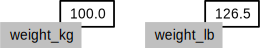

```{r setup, include=FALSE}
knitr::opts_chunk$set(echo = FALSE)
```


# Executing an command in R

The console pane (in RStudio, the bottom left panel) is the place where R is
waiting for you to tell it what to do, and where it will show the results of a
command that has been executed.  You can type commands directly into the console
and press `Enter` to execute those commands. For example we can use R as a calculator:

```{r echo=TRUE}
2+2 
```

# Interacting with R

There are two main ways of interacting with R: using the console or by using
script files (plain text files that contain your code). We want our code and workflow to be reproducible. In other words, we want to write code in a way that
anyone can easily replicate, such they can obtain the same results from our code
on their computer. If we type our commands irectly into the Console,  they will be forgotten when you close the session. It is better to enter the commands in the script editor, and save the script. This way, you have a complete record of what you did, you can easily show others how you did it and you can do it again later on if needed. 

RStudio allows you to execute commands directly from the script editor by using
the <kbd>`Ctrl`</kbd> + <kbd>`Enter`</kbd> shortcut. The command on the current
line in the script or all of the commands in the currently selected text will be
sent to the console and executed when you press <kbd>`Ctrl`</kbd> +
<kbd>`Enter`</kbd>.

At some point in your analysis you may want to check the content of variable or
the structure of an object, without necessarily keep a record of it in your
script. You can type these commands and execute them directly in the console.
RStudio provides the <kbd>`Ctrl`</kbd> + <kbd>`1`</kbd> and <kbd>`Ctrl`</kbd> +
<kbd>`2`</kbd> shortcuts allow you to jump between the script and the console
windows.

If R is ready to accept commands, the R console shows a `>` prompt. If it
receives a command (by typing, copy-pasting or sent from the script editor using
<kbd>`Ctrl`</kbd> + <kbd>`Enter`</kbd>), R will try to execute it, and when
ready, show the results and come back with a new `>`-prompt to wait for new
commands.

If R is still waiting for you to enter more data because it isn't complete yet,
the console will show a `+` prompt. It means that you haven't finished entering
a complete command. This is because you have not 'closed' a parenthesis or
quotation, i.e. you don't have the same number of left-parentheses as
right-parentheses, or the same number of opening and closing quotation marks. If
you're in RStudio and this happens, click inside the console window and press
`Esc`; this will cancel the incomplete command and return you to the `>` prompt.

# Defining Variables

A key concept in any programming language is that of a variable. A variable is just a name, such as `x`, `current_temperature`, or `subject_id` which represents some value. We use the word value here loosely as it could be a singular number, a matrix, or a more complex numerical structure. It also does not have to even be a number it could be a string of text. The idea though is it's value might change and we want to simplify how we process the value.

In R, we can create a new variable simply by assigning a value to it using `<-`

```{r}
weight_kg <- 55
```


Once a variable has a value, we can print it by typing the name of the variable and hitting `Enter` (or `return`).
In general, R will print to the console any object returned by a function or operation *unless* we assign it to a variable.

```{r}
weight_kg
```

We can do arithmetic with the variable:

```{r}
# weight in pounds:
2.2 * weight_kg
```

> ## Commenting
>
> We can add comments to our code using the `#` character. It is useful to
> document our code in this way so that others (and us the next time we
> read it) have an easier time following what the code is doing.


We can also change an object's value by assigning it a new value:

```{r}
weight_kg <- 57.5
# weight in kilograms is now
weight_kg
```

If we imagine the variable as a sticky note with a name written on it,
assignment is like putting the sticky note on a particular value:


This means that assigning a value to one object does not change the values of other variables.
For example, let's store the subject's weight in pounds in a variable:

```{r}
weight_lb <- 2.2 * weight_kg
# weight in kg...
weight_kg
# ...and in pounds
weight_lb
```


and then change `weight_kg`:

```{r}
weight_kg <- 100.0
# weight in kg now...
weight_kg
# ...and weight in pounds still
weight_lb
```



Since `weight_lb` doesn't "remember" where its value came from, it isn't automatically updated when `weight_kg` changes.
This is different from the way spreadsheets work.

> ## Printing with Parentheses
>
> An alternative way to print the value of a variable is to use () around the assignment statement.
> As an example: `(total_weight <- weight_kg + weight_lb)` adds the values of `weight_kg` and `weight_lb`,
> assigns the result to the `total_weight`,
> and finally prints the assigned value of the variable `total_weight`.


> ## Assigning Values to Variables
>
> Draw diagrams showing what variables refer to what values after each statement in the following program:
>
> ~~~
> mass <- 47.5
> age <- 122
> mass <- mass * 2.0
> age <- age - 20
> ~~~
